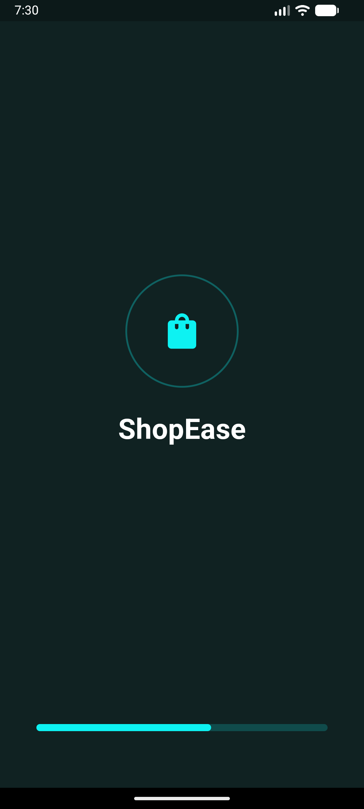
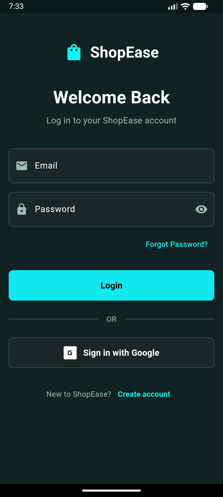
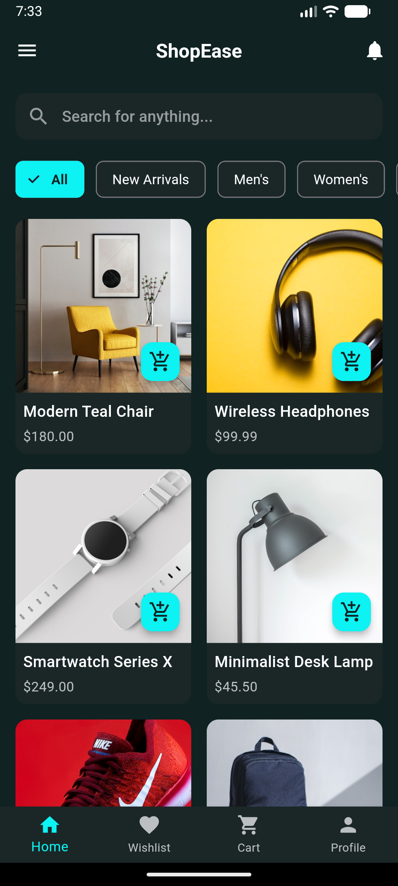
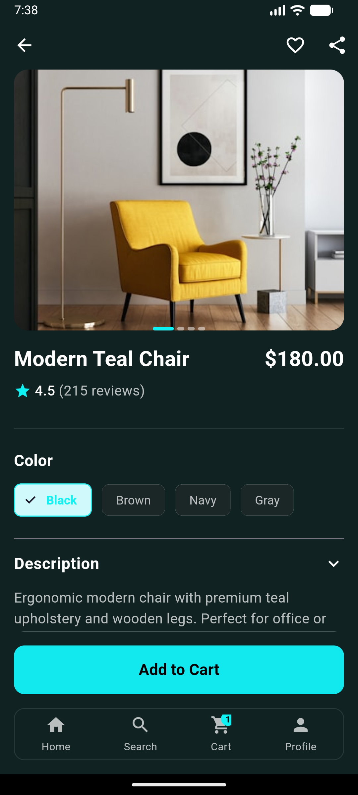
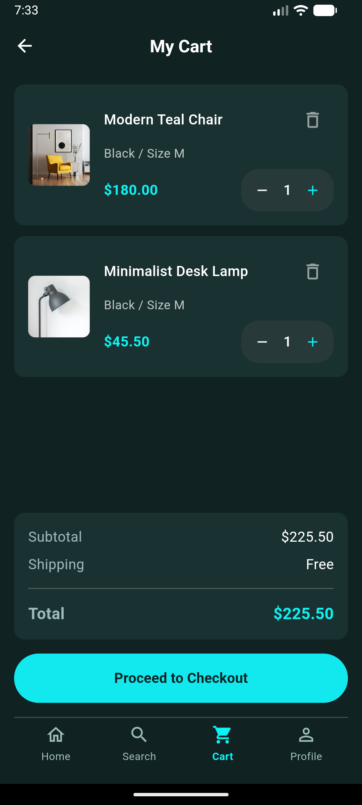
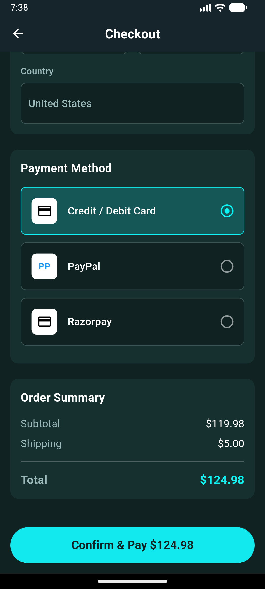
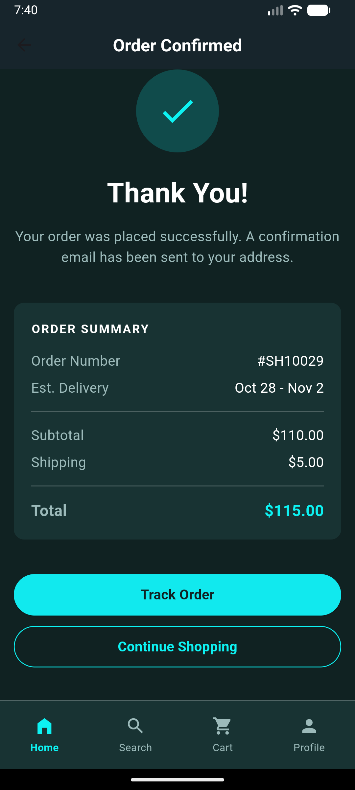
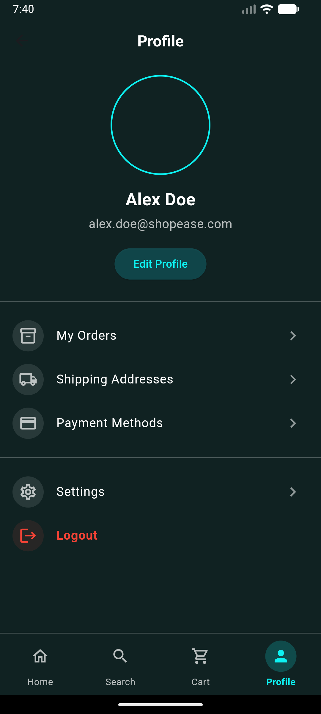

# 🛍️ ShopEase - Flutter E-Commerce App

A modern, beautiful, and fully functional e-commerce mobile application built with Flutter. ShopEase provides a seamless shopping experience with a stunning dark theme UI and smooth animations.

![ShopEase Banner]
<h1 align="center">
  🛍️ ShopEase - Flutter E-Commerce App
</h1>
<p align="center">
  A modern, beautiful, and fully functional e-commerce mobile application
</p>

## 📱 App Screenshots

### Onboarding & Authentication
| Splash Screen | Onboarding | Login Screen |
|---------------|------------|--------------|
|  |  |  |

### Main Application Flow
| Home Screen | Product Details | Shopping Cart |
|-------------|-----------------|---------------|
|  |  |  |

### Checkout & Profile
| Checkout | Order Confirmation | User Profile |
|----------|-------------------|--------------|
|  |  |  |

## ✨ Features

### 🎯 Core Features
- **User Authentication** - Secure login and user management
- **Product Catalog** - Beautiful product grid with categories
- **Product Details** - Comprehensive product information with image carousel
- **Shopping Cart** - Add/remove items with quantity management
- **Checkout Process** - Complete order placement with address and payment
- **Order Management** - Order tracking and history
- **User Profile** - Personal information and settings

### 🎨 UI/UX Features
- **Dark Theme Design** - Easy on eyes with modern aesthetics
- **Smooth Animations** - Fluid transitions and micro-interactions
- **Responsive Layout** - Optimized for various screen sizes
- **Intuitive Navigation** - Bottom navigation with clear hierarchy
- **Loading States** - Beautiful loading indicators and skeleton screens

### 🔧 Technical Features
- **State Management** - Provider for efficient state management
- **Clean Architecture** - Well-organized project structure
- **Reusable Components** - Modular and maintainable code
- **Form Validation** - Robust input validation
- **Error Handling** - Graceful error handling and user feedback

## 🛠️ Technology Stack

- **Framework**: Flutter 3.0+
- **Language**: Dart
- **State Management**: Provider
- **Local Storage**: Shared Preferences
- **UI Components**: Material Design 3
- **Icons**: Material Icons
- **Fonts**: Plus Jakarta Sans

## 🎨 Design System

### Color Palette
```dart
primary: #0DF2F2      // Teal accent color
background-dark: #102222  // Dark background
surface-dark: #1B2727     // Card backgrounds
text-primary: #FFFFFF     // White text
text-secondary: #9CBABA   // Light gray text
border-dark: #3B5454      // Border colors
